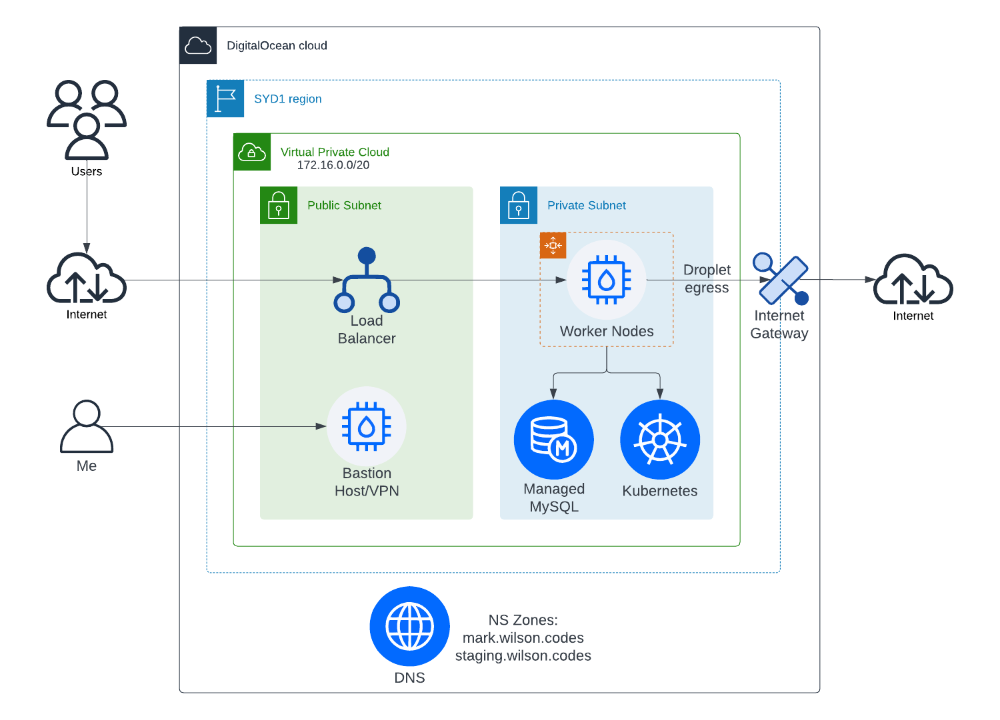
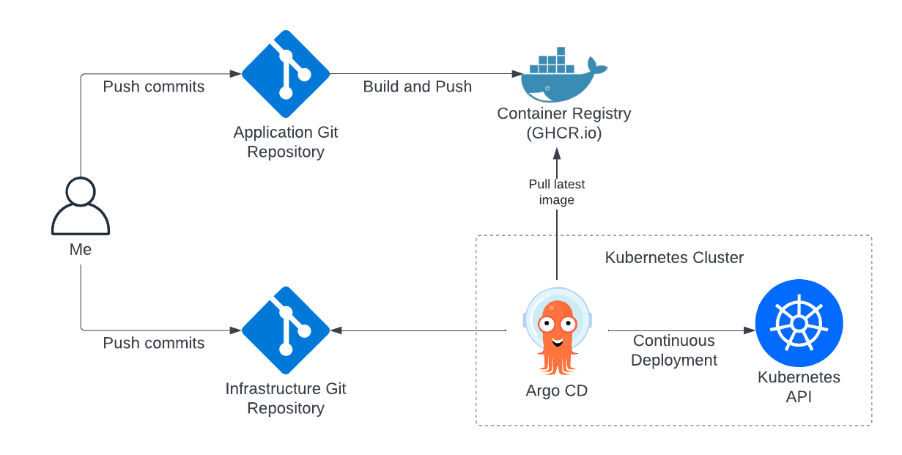

# Personal Website Infrastructure

## Overview

This repository is dedicated to managing the infrastructure for my [personal website](https://github.com/markwcodes/personal-website). As part of a dual repository setup, the application code resides in a separate repository, ensuring a clear separation of concerns between the infrastructure and the application.

This repository utilises Terraform for automated infrastructure provisioning and deployments through GitHub Actions, and follows a GitOps deployment workflow with ArgoCD within the cluster for continuous delivery.

Helm charts enable dynamic Kubernetes configuration and deployments, according to the environment.

With this project being completely open source on Github, ensuring its security will be of utmost importance. The use of secret variables, sealed secrets, firewalls, image vulnerability scanning, etc will be employed.

Cost is a key consideration, and therefore I have chosen to use DigitalOcean as my cloud environment. A similar setup on AWS would be around 5x the cost of DO.

## Requirements and Architecture

### Need to haves

- [x] Support for production and [staging](https://github.com/markwcodes/personal-website-infra/deployments/Staging) environments, with infrastructure state reflected from their respective branches
- [x] Terraform deploys resources via Github Actions
- [x] Argo CD with git-ops for personal website app
- [ ] Argo CD Image Updator
- [x] Kustomize templating for personal website app
- [ ] Semantic versioning for app images
- [ ] Database-first app deployments
- [ ] Code exception monitoring

### Nice to haves

- [ ] Prometheus monitoring + Grafana
- [ ] Hashicorp vault for secrets
- [ ] Cert Manager and External DNS
- [ ] Kubernetes RBAC
- [ ] Bastion/VPN for secure access into cloud environment

### DigitalOcean Network Diagram



### GitOps Flow



### Application Diagram

WIP

## Setup and Configuration

### Terraform Initialisation

In the DigitalOcean web interface:

1. Create a new project and obtain your DigitalOcean token.
2. Update the `do_token` Terraform value in the terraform.tfvars file with your token.
3. Create a new Space with a unique name.
4. Replace the `bucket` Terraform value in `backend-config.tfvars` with your unique Space name.
5. Generate access credentials for the Space under API -> Space keys -> Generate new key.
6. Update the `access_key` and `secret_key` values in `backend-config.tfvars` with your access keypair.
7. Initialise Terraform using the `backend-config.tfvars` file:\
   `terraform init -backend-config=backend-config.tfvars`
8. Create a new Terraform workspace:\
   `terraform workspace new staging`
9. Check your Space storage to confirm that the remote state file has been added.

#### Alternative ENV based method (for CI/CD environments):

Set these **private** environment variables (Github Actions secrets):

- `spaces_access_token`
- `spaces_secret_key`
- `tf_state_bucket`

Then run:

``` bash
terraform init \
 -backend-config="access_key=$spaces_access_token" \
 -backend-config="secret_key=$spaces_secret_key" \
 -backend-config="bucket=$tf_state_bucket"
```

### Terraform Plan, Build, and Deployment

Github Actions will handle plans and deployments when changes are made to any Terraform files or configuration files. A comment containing the Terraform plan will be added to the Pull Request. If the plan has no errors, you can apply the plan by merging the Pull Request.

Note: Terraform infrastructure changes should always be done from a single location (Github Actions) for safety and consistency of state. However if you configure your local environment with the same environment variables it is possible to manage infrastructure changes from your machine, if manual intervention is required.
